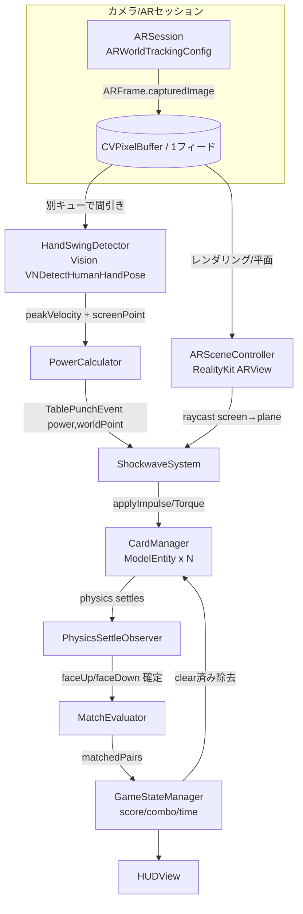
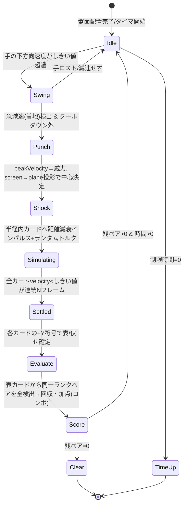
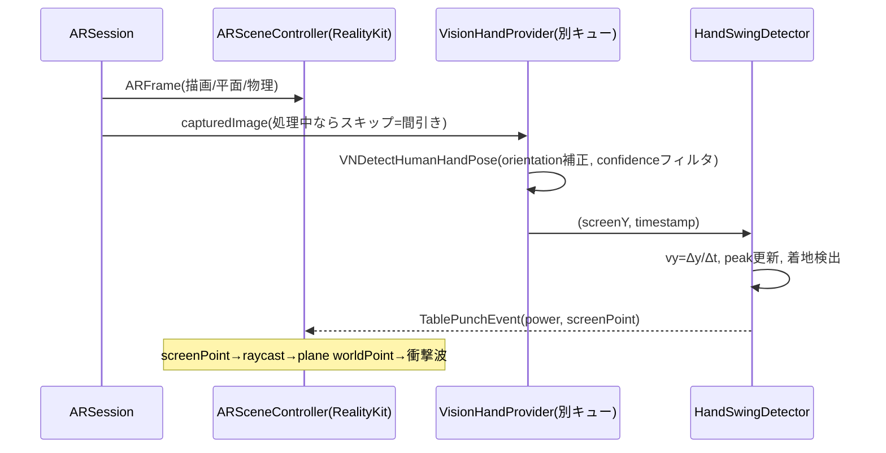
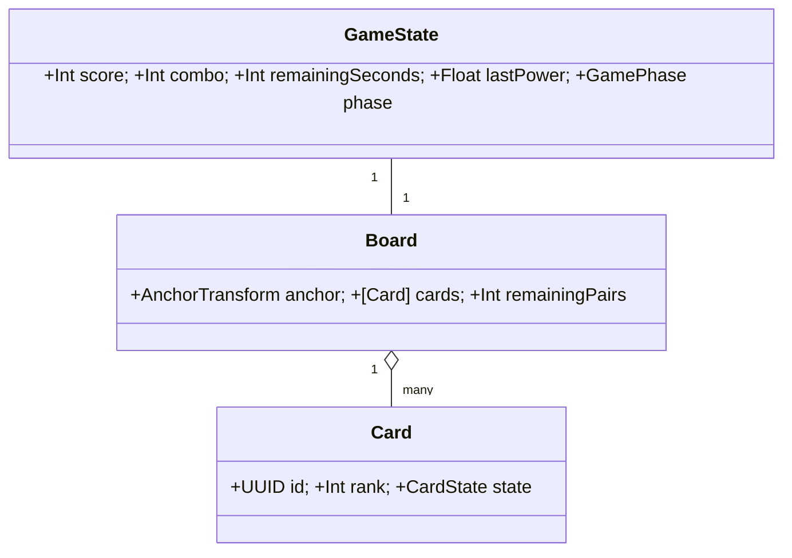

# Design Document — ar-tablebang-concentration

## Overview

本機能は、iPhone単体で遊ぶAR神経衰弱ゲーム「台パン神経衰弱」を実現する。プレイヤーは片手でiPhoneを持ち、もう一方の手でテーブルを叩く（台パン）。背面カメラの1フレーム（`ARFrame.capturedImage`）を、ARKitのワールドトラッキング（平面検出・カードのAR配置）と Apple Vision の手検出（振り下ろし速度算出）の双方に供給し、専用デバイスなしに「叩く強さで威力が決まる物理神経衰弱」を成立させる。

**Purpose**: 台パンの振り下ろし速度を威力に変換し、AR盤面のトランプへ物理インパルスを与えて跳ね・回転・着地させ、表になったカードから同一ランクのペアを自動成立・回収する遊びを提供する。
**Users**: ハッカソンのデモ参加者／単一プレイヤー。テーブルとARKit対応iPhoneがあればその場で遊べる。
**Impact**: 新規グリーンフィールド。既存システムへの変更はない。

### Goals
- 1つのカメラフィードで ARKit ワールドトラッキング ＋ Vision 手検出 ＋ RealityKit 物理を同時稼働させ、実機でプレイ可能なフレームレートを保つ。
- 振り下ろしのピーク速度を威力に変換し、衝撃波として距離減衰インパルスを複数カードへ与える。
- 物理挙動を非決定論にし（浮くだけ／半回転／一回転／複数回転）、静止後に表/伏せを確定する。
- 表のカードから同一ランク2枚を自動成立させ、全成立ペアを一括回収・スコア加点（コンボ対応）。
- 主要パラメータ（速度しきい値・威力レンジ・影響半径・物理係数）をコードから容易に調整可能にする。

### Non-Goals
- Android（ARCore）、AR/VRヘッドセット対応。
- マルチプレイ（交代・ネット対戦）、オンライン同期、ランキングサーバー、アカウント。
- 物理トランプの画像認識（カードは完全に仮想）。
- 記憶ゲーム要素（時間経過での自動伏せ戻し）。状態変化は台パンの物理結果のみで駆動。
- MediaPipe 連携（差し替え余地は残すが本MVPでは実装しない）。

## Boundary Commitments

### This Spec Owns
- ARセッション管理（権限・ワールドトラッキング・水平面検出・盤面アンカー）。
- AR神経衰弱の盤面生成（各ランク2枚ずつのデッキ、格子配置、伏せ初期状態）。
- 手検出と振り下ろし速度算出、台パン成立判定、威力算出。
- 衝撃波の生成と距離減衰インパルス付与、カードの物理挙動。
- カード状態管理（伏せ／表／回収済み・物理状態）、静止検出、表裏判定。
- ペア自動成立・回収・スコア／コンボ、ゲーム進行（タイムアタック）、HUD。
- 主要パラメータの外出し（`GameConfig`）。

### Out of Boundary
- ネットワーク通信、永続化されたハイスコア（MVPはアプリ内メモリのみ）。
- 多言語UI、アクセシビリティの作り込み。
- 高度なカード3Dアート・シェーダ演出（最小限の見栄えに留める）。

### Allowed Dependencies
- Apple OSフレームワーク: ARKit, RealityKit, Vision, AVFoundation（権限）, CoreHaptics/UIKit（触覚）, Combine。
- 端末内処理のみ。カメラ映像を外部送信しない（R10-6）。

### Revalidation Triggers
- 手検出方式の差し替え（Vision→MediaPipe）→ `HandLandmarkProvider` 契約の変更。
- 物理エンジン/ビューの差し替え（ARView→RealityView）→ `ARSceneController` 契約の変更。
- カード状態モデルやペア判定ルールの変更 → `MatchEvaluator`／`Card` 契約の変更。

## Architecture

### Architecture Pattern & Boundary Map

レイヤード＋イベント駆動。カメラ1フィードを2つの消費者（AR/物理 と 手検出）へ分配し、台パンイベントを起点に「威力算出→衝撃波→物理→静止→ペア判定→スコア/HUD」が流れる。



**Architecture Integration**:
- Selected pattern: レイヤード（Input / AR・物理 / ゲームロジック / UI）＋イベント駆動（`TablePunchEvent` を起点に一方向フロー）。
- Domain/feature boundaries: 「入力（手検出・威力）」「AR・物理（シーン・カード・衝撃波）」「ゲームロジック（ペア・スコア・進行）」「UI（HUD）」を分離。各境界はプロトコルで接続し差し替え可能。
- New components rationale: 各責務を単一クラスに割り当て、台パン1回のイベントフローをテスト可能にする。
- Steering compliance: steering未整備（新規）。本design自体が初期規約となる。

### Technology Stack

| Layer | Choice / Version | Role in Feature | Notes |
|-------|------------------|-----------------|-------|
| Frontend / UI | SwiftUI + UIKit ブリッジ | HUD（時間/スコア/威力ゲージ）、画面遷移 | `ARView` は `UIViewRepresentable` で内包 |
| AR / Rendering | ARKit + RealityKit（`ARView`, iOS） | 平面検出・アンカー・カード描画・物理 | SceneKitは保守モードのため不採用 |
| Physics | RealityKit PhysicsBody/Motion | カードの剛体・インパルス・静止・表裏 | 公開isSleeping無し→velocityしきい値 |
| Hand Detection | Apple Vision `VNDetectHumanHandPoseRequest`（iOS 14+） | 手ランドマーク→振り下ろし速度 | 依存ゼロ。`HandLandmarkProvider`で差し替え可 |
| Permissions | AVFoundation（カメラ権限） | 起動時権限要求 | 拒否時は設定導線 |
| Feedback | CoreHaptics / AVAudioPlayer | 台パン・めくり・ペアの触覚/効果音 | |
| State / Glue | Combine | イベント配信・状態購読 | |

**対象**: iOS（Swift）、ARKit対応iPhone（A12 Bionic以降目安）、iOS 16+ を想定（Vision/RealityKit機能の安定動作）。

## File Structure Plan

### Directory Structure
```
TableBangConcentration/
├── App/
│   ├── TableBangApp.swift            # @main エントリ、ルートView
│   └── AppCoordinator.swift          # 画面状態(権限/プレイ/結果)の遷移
├── AR/
│   ├── ARSceneController.swift       # ARView生成・WorldTrackingConfig・平面検出・raycast・アンカー
│   ├── ARViewContainer.swift         # SwiftUIへARViewを橋渡し(UIViewRepresentable)
│   └── PlaneDetectionGuide.swift     # 平面未検出時のガイド状態
├── Cards/
│   ├── CardEntity.swift              # ModelEntity派生: 1枚のカード(physicsBody/collision/表面+Y)
│   ├── CardManager.swift             # デッキ生成・格子配置・状態(伏/表/回収)・床/壁コライダー
│   └── DeckFactory.swift             # 各ランク2枚ずつのデッキ構築・ランク割当
├── Physics/
│   ├── ShockwaveSystem.swift         # 中心・威力・半径→距離減衰インパルス+ランダムトルク付与
│   └── PhysicsSettleObserver.swift   # velocityしきい値で静止検出→表裏確定→通知
├── Input/
│   ├── HandLandmarkProvider.swift    # protocol: フレーム→手代表点(screen座標+timestamp)
│   ├── VisionHandProvider.swift      # Vision実装(VNDetectHumanHandPoseRequest, 別キュー, 間引き)
│   ├── HandSwingDetector.swift       # 速度時系列→ピーク速度→台パン(着地)成立判定+クールダウン
│   └── PowerCalculator.swift         # ピーク速度→威力値へ正規化(クランプ)
├── Game/
│   ├── MatchEvaluator.swift          # 表カード走査→同一ランクペア検出(複数同時)
│   ├── GameStateManager.swift        # スコア/コンボ/残カード/制限時間/勝敗
│   └── GameConfig.swift              # 調整パラメータ集約(しきい値/レンジ/半径/物理係数/盤面)
├── UI/
│   ├── HUDView.swift                 # 残時間・スコア・威力ゲージ・コンボ・補助ガイド
│   ├── ResultView.swift             # クリア/タイムアップ結果・リトライ
│   └── PermissionView.swift          # カメラ権限要求/拒否時の設定導線
├── Feedback/
│   └── FeedbackController.swift      # 触覚(CoreHaptics)+効果音
└── Support/
    ├── Events.swift                  # TablePunchEvent 等のイベント型
    └── CoordinateMath.swift          # Vision正規化座標→ARView画面座標(displayTransform)、screen↔plane投影、向き補正、+Y法線→表裏判定ヘルパ
```

> カードは `CardEntity` が1責務（1枚の物理ボディ＋表面ローカル+Y）。`CardManager` が集合・状態・配置・床/壁を担う。`HandLandmarkProvider` をprotocol化し、Vision実装を差し替え可能にする（MediaPipe移行余地）。

### Modified Files
- なし（新規プロジェクト）。

## System Flows

### 台パン1回のメインフロー（状態遷移）


### カメラフレーム分配（並行処理）


## Requirements Traceability

| Requirement | Summary | Components | Flows |
|-------------|---------|------------|-------|
| 1.1–1.5 | カメラ権限・AR初期化・平面検出ガイド | PermissionView, ARSceneController, PlaneDetectionGuide | フレーム分配 |
| 2.1–2.6 | 盤面生成（格子・伏せ・各ランク2枚・アンカー固定・デバッグ自動配置） | CardManager, DeckFactory, CardEntity, ARSceneController | — |
| 3.1–3.5 | 手検出・代表点時系列・下方向速度・未検出処理・低遅延 | VisionHandProvider, HandLandmarkProvider, HandSwingDetector, CoordinateMath | フレーム分配 |
| 4.1–4.6 | 台パン成立・威力算出・正規化・中心投影・クールダウン・未検出停止 | HandSwingDetector, PowerCalculator, ARSceneController(raycast) | メインフロー |
| 5.1–5.8 | 衝撃波・威力→半径・距離減衰インパルス・物理解決・非決定論・着地確定・FB・盤外制約 | ShockwaveSystem, CardManager, PhysicsSettleObserver, FeedbackController | メインフロー |
| 6.1–6.6 | 各ランク2枚・静止後走査・全ペア同時回収・コンボ・未成立保持・状態更新 | MatchEvaluator, GameStateManager, CardManager | メインフロー |
| 7.1–7.6 | 表保持・物理有効維持・物理由来再反転・後続成立・状態一貫・時間伏戻無し | CardManager, CardEntity, PhysicsSettleObserver, MatchEvaluator | メインフロー |
| 8.1–8.5 | タイマ開始・全クリア・タイムアップ・リトライ・設定値 | GameStateManager, ResultView, GameConfig | メインフロー |
| 9.1–9.5 | 残時間/スコア・威力提示・コンボFB・手未検出ガイド・視認配慮 | HUDView, GameStateManager | — |
| 10.1–10.6 | 性能・iOS対象・揺れ固定・ロスト復帰・パラメータ外出し・端末内処理 | ARSceneController, VisionHandProvider, GameConfig, PhysicsSettleObserver | フレーム分配 |

## Components and Interfaces

| Component | Layer | Intent | Req Coverage | Key Dependencies | Contracts |
|-----------|-------|--------|--------------|------------------|-----------|
| ARSceneController | AR | ARView/トラッキング/平面/raycast/アンカー | 1,2,4,10 | RealityKit, ARKit | State |
| HandLandmarkProvider | Input | フレーム→手代表点（抽象） | 3 | — | Service |
| VisionHandProvider | Input | Vision実装・間引き・向き補正 | 3,10 | Vision | Service |
| HandSwingDetector | Input | 速度算出・台パン成立・クールダウン | 3,4 | HandLandmarkProvider | Service/Event |
| PowerCalculator | Input | ピーク速度→威力正規化 | 4 | GameConfig | Service |
| ShockwaveSystem | Physics | 距離減衰インパルス＋ランダムトルク | 5 | CardManager, GameConfig | Service |
| CardEntity | Cards | 1枚のカード剛体（表面+Y） | 2,5,7 | RealityKit | State |
| CardManager | Cards | デッキ・配置・状態・床/壁 | 2,5,6,7 | CardEntity, DeckFactory | State |
| PhysicsSettleObserver | Physics | 静止検出→表裏確定→通知 | 5,6,7,10 | CardManager | Event |
| MatchEvaluator | Game | 表カードの同一ランクペア検出 | 6,7 | CardManager | Service |
| GameStateManager | Game | スコア/コンボ/時間/勝敗 | 6,8,9 | MatchEvaluator, GameConfig | State/Event |
| HUDView | UI | 時間/スコア/威力/コンボ/ガイド | 9 | GameStateManager | State |
| GameConfig | Game | 調整パラメータ集約 | 4,5,8,10 | — | State |

### Input Layer

#### HandLandmarkProvider / VisionHandProvider
| Field | Detail |
|-------|--------|
| Intent | カメラフレームから手の代表点（画面座標＋時刻）を供給する抽象と Vision 実装 |
| Requirements | 3.1, 3.2, 3.4, 3.5, 10.1, 10.6 |

**Responsibilities & Constraints**
- `ARFrame.capturedImage`(CVPixelBuffer)を入力に、中指MCP（手のひら中心相当）を代表点として返す。
- 推論は専用シリアルキュー（`.userInitiated`）で実行。`isProcessing` フラグで前フレーム処理中はスキップ（間引き）。
- 端末向きから `CGImagePropertyOrientation` を算出して `VNImageRequestHandler` に渡す。
- **座標変換（実装難所）**: Vision の出力は正規化座標（左下原点・`capturedImage` のセンサ向き基準）。これを ARView 上の画面座標（UIKit points・左上原点）へ写すには単純な y 反転では不十分で、回転・アスペクト比・クロップを含む `ARFrame.displayTransform(for:viewportSize:)` を適用する必要がある。誤ると台パン中心（raycast 投影元）が大きくズレる。変換ロジックは `CoordinateMath` に集約し純関数としてテスト可能にする。
- confidence < しきい値の点は破棄し「未検出」とする。
- カメラ映像は端末外へ送信しない。

**Dependencies**
- Outbound: HandSwingDetector — 代表点供給（P0）
- External: Vision.framework（P0）

**Contracts**: Service [x]

```swift
struct HandSample {
    let screenPoint: CGPoint   // 画面座標(左上原点, 0..1 or points)
    let timestamp: TimeInterval
    let confidence: Float
}

protocol HandLandmarkProvider: AnyObject {
    /// 検出した代表点を非同期に流す。未検出のフレームでは発行しない。
    var samples: AnyPublisher<HandSample, Never> { get }
    func process(frame: ARFrame, interfaceOrientation: UIInterfaceOrientation)
}
```
- Preconditions: フレームは有効な `capturedImage` を持つ。
- Postconditions: confidence>=しきい値のときのみ `HandSample` を発行。
- Invariants: 同時に1推論のみ（in-flightガード）。

#### HandSwingDetector
| Field | Detail |
|-------|--------|
| Intent | 代表点の時系列から下方向ピーク速度を求め、振り下ろし→急減速（着地）を台パンとして検出 |
| Requirements | 3.3, 4.1, 4.2, 4.5, 4.6 |

**Responsibilities & Constraints**
- `vy = (yₜ − yₜ₋₁)/Δt`（Δtは実測）。下向きを正に固定。リングバッファで平滑化（EMA）。
- 下降継続中の `|vy|` の最大をピークとして保持。ピークが台パンしきい値超過の後に急減速/反転 → 台パン成立。
- クールダウン窓内の連続成立は抑制（誤検出暴発防止）。手未検出が続く間は判定しない。

**Contracts**: Service [x] / Event [x]

```swift
struct TablePunchEvent {
    let peakVelocity: CGFloat   // 画面座標系の相対速度(/s)
    let screenPoint: CGPoint    // 着地時の代表点(投影元)
}

protocol HandSwingDetecting: AnyObject {
    var punches: AnyPublisher<TablePunchEvent, Never> { get }
}
```
- Preconditions: `HandSample` ストリームを購読済み。
- Postconditions: クールダウン外でのみ `TablePunchEvent` を発行。
- Invariants: 速度算出は実測Δtのみ使用（固定値禁止）。

#### PowerCalculator
| Field | Detail |
|-------|--------|
| Intent | ピーク速度を威力値[0,1]（または最小〜最大）へ正規化 |
| Requirements | 4.2, 4.3 |

```swift
struct PowerCalculator {
    let config: GameConfig
    /// peakVelocity を minPower..maxPower にクランプ正規化
    func power(from peakVelocity: CGFloat) -> Float
}
```
- Postconditions: 戻り値は `config.minPower...config.maxPower` にクランプ。

### AR Layer

#### ARSceneController
| Field | Detail |
|-------|--------|
| Intent | ARセッション運用、平面検出、盤面アンカー、screen→plane raycast、フレーム分配 |
| Requirements | 1.3, 1.4, 1.5, 2.1, 2.5, 4.4, 10.1, 10.3, 10.4 |

**Responsibilities & Constraints**
- `ARWorldTrackingConfiguration(planeDetection:[.horizontal])` でセッション運用。
- `session(_:didUpdate:)` で①RealityKitレンダリング/物理は内部処理、②`capturedImage` を `HandLandmarkProvider.process` へ委譲（間引きは provider 側）。
- 台パン成立時、`screenPoint` を `arView.raycast(from:allowing:.existingPlaneInfinite, alignment:.horizontal)` で平面の `worldPoint` に投影し `ShockwaveSystem` に渡す。
- トラッキング品質低下時は HUD にガイドを促す。`AnchorEntity(world:)` 基準で盤面を現実空間固定。

**Contracts**: State [x]

```swift
protocol ARSceneControlling: AnyObject {
    var trackingState: AnyPublisher<ARCamera.TrackingState, Never> { get }
    var planeReady: AnyPublisher<Bool, Never> { get }
    func placeBoard(atScreenPoint: CGPoint)            // タップ位置→アンカー確定
    func worldPoint(fromScreen: CGPoint) -> SIMD3<Float>?  // raycast投影
}
```

### Cards Layer

#### CardEntity
| Field | Detail |
|-------|--------|
| Intent | 1枚のトランプ。薄い箱の剛体。表面をローカル+Yに固定 |
| Requirements | 2.2, 2.4, 5.4, 7.2 |

**Responsibilities & Constraints**
- `ModelEntity`（薄い箱）＋ `PhysicsBodyComponent(mode:.dynamic)` ＋ box `CollisionComponent`。
- 表面=ローカル+Y、裏面=ローカル−Y。`rank: Int` を保持。
- 表のカードも `.dynamic` を維持し後続インパルスを受ける（疑似スリープ時のみ一時 `.static`）。

```swift
final class CardEntity: Entity, HasModel, HasPhysics {
    let rank: Int
    private(set) var state: CardState   // .faceDown / .faceUp / .collected
    func applyShock(impulse: SIMD3<Float>, at: SIMD3<Float>, torque: SIMD3<Float>)
    func refreshFacing() -> CardState   // worldUp.y 符号で表/伏せ確定
}
enum CardState { case faceDown, faceUp, collected }
```

#### CardManager
| Field | Detail |
|-------|--------|
| Intent | デッキ生成・格子配置・状態集合・床/壁コライダー・回収除去 |
| Requirements | 2.1–2.6, 5.1, 5.2, 5.8, 6.6, 7.1, 7.3, 7.5 |

**Responsibilities & Constraints**
- `DeckFactory` で各ランク2枚ずつ（例8ペア=16枚）を構築、必ずペア成立可能な配置。
- アンカー配下に格子配置、全カード伏せで初期化。`.static` 床と外周不可視壁を設置（盤外防止）。
- 半径内カードの抽出（中心距離）、回収カードのシーン除去、残カード数の管理。
- デバッグモードで平面タップなし自動配置（2.6）。

```swift
protocol CardManaging: AnyObject {
    var cards: [CardEntity] { get }
    func buildBoard(on anchor: AnchorEntity, config: GameConfig)
    func cards(within radius: Float, of center: SIMD3<Float>) -> [CardEntity]
    func collect(_ cards: [CardEntity])     // 回収＝除去
    var remainingPairs: Int { get }
}
```

### Physics Layer

#### ShockwaveSystem
| Field | Detail |
|-------|--------|
| Intent | 中心・威力・半径から距離減衰インパルス＋ランダムトルクを各カードへ付与 |
| Requirements | 5.1, 5.2, 5.3, 5.4, 5.5, 5.8 |

**Responsibilities & Constraints**
- `radius = f(power)`（威力が大きいほど広い、`GameConfig` のカーブ）。
- 各カード: `falloff = max(0, 1 - dist/radius)`、`impulse = (dir + upBias) * power * falloff + randomJitter`、重心オフセット打点で `applyImpulse(_:at:)`、加えて軸ランダム `applyAngularImpulse`。
- 非決定論（浮く/半回転/一回転/複数回転）はオフセット＋ランダムトルク＋反発で表現。

```swift
struct ShockwaveSystem {
    let cardManager: CardManaging
    let config: GameConfig
    func emit(at center: SIMD3<Float>, power: Float)
}
```
- Postconditions: 半径内の全カードにインパルス付与。半径外は不変。

#### PhysicsSettleObserver
| Field | Detail |
|-------|--------|
| Intent | 全カードの静止を検出し、各カードの表/伏せを確定して通知 |
| Requirements | 5.6, 6.2, 7.3, 7.4, 10.4 |

**Responsibilities & Constraints**
- 毎フレーム `PhysicsMotionComponent` の `linearVelocity`/`angularVelocity` を監視。半径内（または全可動）カードがしきい値以下を連続Nフレーム満たしたら「静止」。
- 静止時に各カードの `refreshFacing()`（worldUp.y符号）で状態確定 → `boardSettled` 発行。
- 物理ロスト/異常時もクラッシュせず継続。静止後は疑似スリープ（`.static`化）で負荷削減、次の台パンで `.dynamic` 復帰。

```swift
protocol PhysicsSettleObserving: AnyObject {
    var boardSettled: AnyPublisher<Void, Never> { get }  // 全静止＋表裏確定後
}
```

### Game Layer

#### MatchEvaluator
| Field | Detail |
|-------|--------|
| Intent | 表になっている全カードを走査し、同一ランク2枚の組をすべて検出 |
| Requirements | 6.1, 6.2, 6.3, 6.5, 7.4 |

```swift
struct MatchEvaluator {
    /// 表カードのうち同一ランクが2枚揃う組を全て返す(複数同時可)。
    /// 同一ランクが2枚を超える事はデッキ構成上発生しない(各ランク2枚)。
    func findPairs(faceUp: [CardEntity]) -> [[CardEntity]]
}
```
- Preconditions: 物理静止・表裏確定後に呼ぶ。
- Postconditions: 相手が表に揃わないカードは結果に含めない（表のまま保持）。

#### GameStateManager
| Field | Detail |
|-------|--------|
| Intent | スコア・コンボ・残ペア・制限時間・勝敗の単一情報源 |
| Requirements | 6.3, 6.4, 6.6, 8.1, 8.2, 8.3, 8.4, 9.1, 9.3 |

**Responsibilities & Constraints**
- `boardSettled` → `MatchEvaluator.findPairs` → 成立ペアを `CardManager.collect`、スコア加算。1回の確定で複数ペアならコンボ倍率を上げる。
- タイマ駆動（制限時間）。残ペア0で `.clear`、時間0で `.timeUp`。
- 状態は `@Published`／Publisher で HUD・Result が購読。

```swift
enum GamePhase { case placing, playing, clear, timeUp }
final class GameStateManager: ObservableObject {
    @Published private(set) var score: Int
    @Published private(set) var combo: Int
    @Published private(set) var remainingSeconds: Int
    @Published private(set) var lastPower: Float
    @Published private(set) var phase: GamePhase
    func startTimer(); func onBoardSettled(); func retry()
}
```

### GameConfig（パラメータ外出し）
| Field | Detail |
|-------|--------|
| Intent | 調整値を1箇所に集約（R10-5） |
| Requirements | 4.3, 5.2, 8.5, 10.5 |

```swift
struct GameConfig {
    // 入力/威力
    var swingVelocityThreshold: CGFloat
    var punchCooldown: TimeInterval
    var minPower: Float; var maxPower: Float
    // 衝撃波/物理
    var radiusForMinPower: Float; var radiusForMaxPower: Float
    var upwardBias: Float
    var impulseJitter: ClosedRange<Float>
    var torqueRange: ClosedRange<Float>
    var cardMass: Float; var friction: Float; var restitution: Float
    var settleLinearThreshold: Float; var settleAngularThreshold: Float
    var settleFrameCount: Int
    // 盤面/進行
    var pairCount: Int            // 例: 8 (=16枚)
    var gridColumns: Int
    var cardSize: SIMD3<Float>    // カードの物理寸法[幅, 厚み, 奥行] (m)。薄い箱。例: [0.06, 0.002, 0.09]
    var cardSpacing: Float        // 格子セル間隔 (m)。カード同士が初期状態で重ならない値
    var boardInset: Float         // 盤面外周〜不可視壁までの余白 (m)
    var timeLimitSeconds: Int
    var comboMultiplierStep: Float
    static let `default`: GameConfig = .init(/* たたき台値 */)
}
```

## Data Models

### Domain Model
- **Card**: `id`, `rank: Int`, `state: {faceDown, faceUp, collected}`, 物理トランスフォーム（RealityKit保持）。表面=ローカル+Y。各ランクちょうど2枚（不変条件）。
- **Board**: `cards: [Card]`、`anchorTransform`、`remainingPairs`。
- **GameState**: `score`, `combo`, `remainingSeconds`, `lastPower`, `phase`。



**Invariants**:
- 各 `rank` はデッキ内にちょうど2枚（ペア成立可能性を保証, R2-4）。
- `state == collected` のカードはシーンから除去され物理対象外。
- 表裏状態は物理静止後の `worldUp.y` 符号でのみ確定（時間で変化しない, R7-6）。

### Physical Data Model
- 永続化なし（MVPはメモリ内のみ）。RealityKit ECSがトランスフォーム・物理状態を保持。

## Error Handling

### Error Strategy
ユーザー起因はガイド表示で回復、システム起因はクラッシュ回避と継続を最優先。

### Error Categories and Responses
- **カメラ権限拒否（User）**: 機能不可メッセージ＋設定アプリ導線（`UIApplication.openSettings`）。盤面生成へ進ませない（R1-2）。
- **平面未検出（User）**: 「テーブルにカメラを向けてください」ガイド継続（R1-4）。一定広さ検出で配置可能提示。
- **手未検出/低信頼度（Business）**: 台パン判定を停止し、HUDに「手をカメラに写してください」を必要時表示（R3-4, R4-6, R9-4）。復帰後に継続。
- **トラッキング品質低下（System）**: `ARCamera.TrackingState` を購読し、limited/notAvailable時はガイド。アンカー基準で盤面固定を維持（R10-3）。
- **手検出推論の例外/タイムアウト（System）**: 当該フレームを破棄し次フレームへ。`isProcessing` 解除を `defer` で保証（キュー詰まり防止）。
- **物理ロスト/異常（System）**: 静止検出が進まない場合のウォッチドッグ（最大待ち時間でフォールバック確定）→ ペア判定へ（R10-4）。

### Monitoring
- デバッグHUDに実効FPS、手検出レイテンシ、検出confidence、可動カード数を表示（開発時のみ）。

## Testing Strategy

### Unit Tests
- `HandSwingDetector`: 合成した `HandSample` 列（一定Δt）で、ピーク速度抽出・急減速での台パン成立・クールダウン抑制・手未検出時の非成立を検証（R3.3/4.1/4.5/4.6）。
- `PowerCalculator`: 速度→威力が `min..max` にクランプ・単調増加することを検証（R4.2/4.3）。
- `MatchEvaluator`: 表カード集合に対し、複数同時ペア検出・相手未表時の非成立・回収後整合を検証（R6.1/6.3/6.5）。
- `DeckFactory`: 各ランクちょうど2枚の不変条件・盤面サイズ整合（R2-3/2-4）。
- `ShockwaveSystem`: 半径内のみ対象・距離減衰の単調性（純関数部分を抽出してテスト, R5.2/5.3）。

### Integration Tests
- フレーム→Vision(モック provider)→`HandSwingDetector`→`PowerCalculator`→`TablePunchEvent` の連鎖（Inputレイヤ結線, R3/R4）。
- `boardSettled`→`MatchEvaluator`→`GameStateManager`（回収・加点・コンボ・残ペア更新, R6/R7/R8）。
- raycast 投影（`worldPoint(fromScreen:)`）→ `ShockwaveSystem.emit` の中心一致（R4.4/R5.1）。

### E2E / 実機テスト（手動・クリティカルパス）
- 起動→権限許可→平面検出→盤面配置→台パン→複数カードめくれ→ペア自動回収→全クリア結果（R1〜R8の主要動線）。
- 権限拒否→設定導線（R1-2）。
- 強/弱の台パンで影響半径・めくれ枚数が変化することを目視（R5-2）。
- 表のカードが後続台パンで伏せに戻り得ること（R7-3）。

### Performance / Load（実機計測）
- ARKit＋Vision＋16枚物理同時稼働での実効FPS（目標: 滑らかにプレイ可能, R10-1）。Instrumentsで計測。
- 手検出レイテンシと間引き挙動（in-flightガードでキューが詰まらないこと）。
- 連続台パン時のメモリ/バッファプール健全性（`capturedImage` 解放）。

## Performance & Scalability
- 検出は別キュー＋in-flightガードで間引き（実効15〜30fpsで台パン検出可）。
- コライダーは単純箱、低ポリ・簡易マテリアル。静止カードは疑似スリープ（`.static`化）で物理負荷削減、台パン時 `.dynamic` 復帰。
- 盤外防止は `.static` 壁＋速度クランプ＋インパルス上限＋damping。
- 16枚規模を前提。ペア数は `GameConfig.pairCount` で調整（負荷と難度のバランス）。

## Security Considerations
- カメラ映像・手ランドマークはすべて端末内処理。外部送信・保存を行わない（R10-6）。
- 権限は最小（カメラのみ）。`Info.plist` の `NSCameraUsageDescription` を明記。

## Supporting References
- 技術選定の根拠と出典は `research.md` を参照（Vision採用／RealityKit採用／物理パラメータのたたき台／間引き戦略）。
